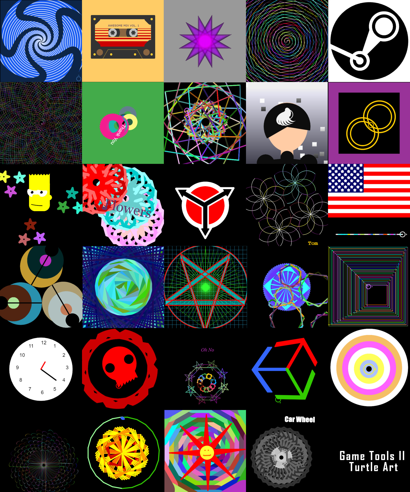

# GAME2004 Game Tools II 2020

## Contact
* Email: robbogucki@gmail.com / rob.bogucki@tudublin.ie

## ONLINE LECTURE
- The lectures will be delivered online via the TU984 Discord for the time being. 

## Final Project
- [Project Brief](https://drive.google.com/open?id=1-92K9HQPE5HhxVSYHcNwUxniUWW5Kp6v)

## Turtle Art results

- [Results image](PosterResults.jpg)
- [Hi-res poster](Poster.png)

## Resources
- [Course Notes](https://drive.google.com/open?id=1zyDfgHkcRRDofioTPWzugJl4dyVEBFIK)

#### Unity/C# Scripting:
- [Unity User Manual](https://docs.unity3d.com/Manual/index.html)
- [Unity Scripting Reference](https://docs.unity3d.com/ScriptReference/index.html)
- [Catlike Coding](https://catlikecoding.com/unity/tutorials/)
- [C# for loop tutorial](https://www.tutorialsteacher.com/csharp/csharp-for-loop)
- [another C# for loop tutorial](https://www.programiz.com/csharp-programming/for-loop)

## Reading
- Ferrone, Harrison (2019) Learning C# by Developing Games with Unity 2019, 4th Ed., Packt Publishing
- Buckland, Mat (2005) Programming Game AI by Example, Worldware Publishing Inc

# Week 9

## AI - Navigation. Learning Objectives:
- Unity AI:Navigation
- NavMeshes: NPC pathfinding and obstacle avoidance
- NavMeshComponents for procedural level NavMesh realtime baking

## Lecture Slides
- ["AI: Navigation"](https://drive.google.com/open?id=114y3rta3tNDM56ZflBrWaCtF8NUs5Y47)

# Week 8

## Animation
- [Unity project - completed lesson](https://github.com/rob-o-tron/AnimationProject)

## Lecture Video
- [Animation lecture](https://youtu.be/G8s9rnH_8vo)

## Assets:
- [Unitypackage with animations](https://drive.google.com/open?id=1iv6Pa4IT1ZcN2vzWdWCvgVj-gN9F4oAS)

## Lecture Slides
- ["Unity Animation"](https://drive.google.com/open?id=1-nRd-jrOk8Qd9u5goVvcWJiFPHlQDVQS)

# Week 7

## "Coding Games"
- exploring visual programming, creative coding exercises, gamified coding practice

## Lecture Videos
- [Part I](https://youtu.be/SxAr7z800gY)
- [Part II](https://youtu.be/8fdD8Wn8wv8)
- [Part III - additional livecoding](https://youtu.be/XigqdAfVt_M)

## Lecture Slides
- ["Coding Games"](https://drive.google.com/open?id=1Dx9D2oO_037fign4brBK4slYWSZoqCR1)

# Week 6 

## Learning Objectives:
- Unity Physics continued: collider triggers, layers, raycasting - practical exercises

## Lecture Videos
- [Part I](https://youtu.be/Ud9mNRj8zIs)
- [Part II](https://youtu.be/hoCkcMobmf0)

## Lecture Slides
- [Unity Physics ctd.](https://drive.google.com/open?id=11r1gMmTOhBr9vp_ysd6-XZCtjRao4494)

# Week 5 - Lab Test 1

## Lab Test 1 solution
The complete solution to the lab test problems was added to the project in this repository. 
Open the 7_LabTest1_COMPLETED.unity scene.

# Week 4

## Learning Objectives:
- Unity Physics: physical simulation background and Unity integration, practical exercises

## Lecture Slides
- [Unity Physics](https://drive.google.com/open?id=1gM5J7J5QPR5_Cgas2LuNchiCmcLG8n7I)

# Week 3

## Learning Objectives:
- Version Control Systems: basics of working with Git repositories
- Lab Exercise 1: City Planning Array - implementing a simple model of the game world using an array

## Student repository link form
- [Submit the link to your repo HERE](https://drive.google.com/open?id=1sSTz-TfBnZftcxyHBLLwOCG4eU6JbZKoR6maeWltpsk)

## Lecture Slides
- [C# Coding, continued](https://drive.google.com/open?id=1IIwSspA76i0LWBtoFDXmn1pCZH9uv3IK)

# Week 2

## Lecture Slides
- [C# Scripting](https://drive.google.com/open?id=1U8Hf1XGZqcuL0iyY4cU58LnDzW_UJQoW)

# Week 1

## [self-assessment questionnaire](https://drive.google.com/open?id=1f_7INGuk2dMZroEpiSTEPUECVNciBymD6uGfW9hFwIQ)

## Lecture Slides
- [Introduction](https://drive.google.com/open?id=1H5r2TIajiFGySHWjGwVMF5_3CzT-KW5i)
- [GameMaths](https://drive.google.com/open?id=1ipDUtpgziVRhjSyYIHSRbqykOkb99m0l)

#### Game maths:
- [Game maths tutorial](http://www.wildbunny.co.uk/blog/vector-maths-a-primer-for-games-programmers/)
- [Unity Vector Cookbook](https://docs.unity3d.com/Manual/VectorCookbook.html)
